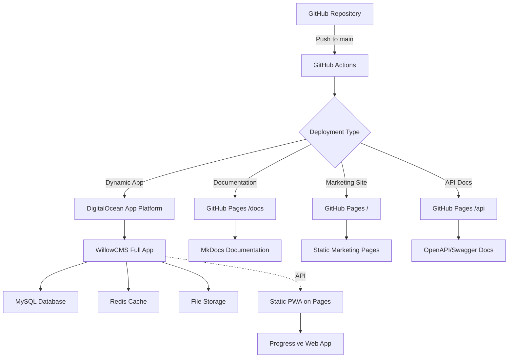

# GitHub Pages Deployment Workflow Guide for WillowCMS

## Executive Summary

GitHub Pages is designed for **static websites**, while WillowCMS is a **dynamic CakePHP application** requiring PHP, MySQL, and Redis. This guide explains how GitHub Pages works and provides strategies to leverage it for WillowCMS documentation, demos, or static exports.

---

## 📚 Table of Contents
1. [Understanding GitHub Pages Workflow](#understanding-github-pages-workflow)
2. [Workflow Breakdown Analysis](#workflow-breakdown-analysis)
3. [WillowCMS Adaptation Strategies](#willowcms-adaptation-strategies)
4. [Implementation Examples](#implementation-examples)
5. [Hybrid Deployment Architecture](#hybrid-deployment-architecture)

---

## 1. Understanding GitHub Pages Workflow

### What GitHub Pages Can Deploy
- ✅ **Static HTML/CSS/JavaScript**
- ✅ **Jekyll sites** (Ruby-based static site generator)
- ✅ **Documentation** (MkDocs, Sphinx, etc.)
- ✅ **Single Page Applications** (React, Vue - client-side only)
- ❌ **Server-side languages** (PHP, Python, Ruby runtime)
- ❌ **Databases** (MySQL, PostgreSQL, Redis)
- ❌ **Dynamic content generation**

### How the Sample Workflow Works

```yaml
name: Deploy to GitHub Pages

on:
  push:
    branches: [main]  # Triggers on push to main
  workflow_dispatch:  # Manual trigger
  schedule:
    - cron: '0 0 * * *'  # Daily at midnight
```

**Key Components:**
1. **Permissions** - Allows writing to Pages
2. **Concurrency** - Prevents overlapping deployments
3. **Three Jobs** - Update → Build → Deploy

---

## 2. Workflow Breakdown Analysis

### Job 1: Update Addons (Data Collection)
```yaml
update-addons:
  steps:
    - Checkout repository
    - Load secrets (1Password integration)
    - Fetch addon data with Go
    - Check for API degradation
    - Commit and push changes
```

**Purpose:** Updates dynamic content that will be built into static pages.

### Job 2: Build (Static Site Generation)
```yaml
build:
  needs: update-addons  # Runs after update
  steps:
    - Checkout (with latest changes)
    - Setup Ruby
    - Bundle install (Jekyll dependencies)
    - Build Jekyll site → _site/
    - Upload artifact for deployment
```

**Key Process:**
- Converts Markdown/templates → Static HTML
- Outputs to `_site/` directory
- Creates deployment artifact

### Job 3: Deploy (Publish to GitHub Pages)
```yaml
deploy:
  needs: build  # Runs after build
  environment:
    name: github-pages
    url: ${{ steps.deployment.outputs.page_url }}
  steps:
    - Deploy artifact to GitHub Pages
```

**Result:** Static site available at `https://username.github.io/repository/`

---

## 3. WillowCMS Adaptation Strategies

### Strategy 1: Documentation Site
Deploy WillowCMS documentation to GitHub Pages while keeping the app elsewhere.

```yaml
name: Deploy WillowCMS Docs

on:
  push:
    branches: [main]
    paths:
      - 'docs/**'
      - '.github/workflows/docs.yml'

jobs:
  build-docs:
    runs-on: ubuntu-latest
    steps:
      - uses: actions/checkout@v4
      
      - name: Setup Node.js
        uses: actions/setup-node@v4
        with:
          node-version: '18'
      
      - name: Install MkDocs
        run: |
          pip install mkdocs
          pip install mkdocs-material
      
      - name: Build Documentation
        run: |
          cd docs
          mkdocs build --site-dir ../_site
      
      - name: Upload Pages Artifact
        uses: actions/upload-pages-artifact@v3

  deploy-docs:
    needs: build-docs
    permissions:
      pages: write
      id-token: write
    environment:
      name: github-pages
      url: ${{ steps.deployment.outputs.page_url }}
    runs-on: ubuntu-latest
    steps:
      - name: Deploy to GitHub Pages
        uses: actions/deploy-pages@v4
```

### Strategy 2: Static Export of CakePHP Content
Export WillowCMS content as static HTML for GitHub Pages.

```yaml
name: Export Static Site

on:
  schedule:
    - cron: '0 2 * * *'  # Daily at 2 AM
  workflow_dispatch:

jobs:
  export-static:
    runs-on: ubuntu-latest
    
    services:
      mysql:
        image: mysql:8.0
        env:
          MYSQL_ROOT_PASSWORD: root
          MYSQL_DATABASE: willowcms
        options: >-
          --health-cmd="mysqladmin ping"
          --health-interval=10s
          --health-timeout=5s
          --health-retries=5
    
    steps:
      - uses: actions/checkout@v4
      
      - name: Setup PHP
        uses: shivammathur/setup-php@v2
        with:
          php-version: '8.1'
          extensions: intl, pdo_mysql, redis
      
      - name: Install Dependencies
        run: |
          cd app
          composer install --no-dev
      
      - name: Import Database
        run: |
          mysql -h 127.0.0.1 -u root -proot willowcms < database/seed.sql
      
      - name: Generate Static Pages
        run: |
          cd app
          # Custom CakePHP command to export static HTML
          bin/cake export_static --output=../_site
      
      - name: Upload Pages Artifact
        uses: actions/upload-pages-artifact@v3
      
  deploy:
    needs: export-static
    permissions:
      pages: write
      id-token: write
    environment:
      name: github-pages
    runs-on: ubuntu-latest
    steps:
      - uses: actions/deploy-pages@v4
```

### Strategy 3: Progressive Web App (PWA) Approach
Build a static PWA that consumes WillowCMS API.

```yaml
name: Deploy PWA Frontend

on:
  push:
    branches: [main]
    paths:
      - 'frontend/**'
      - '.github/workflows/pwa.yml'

jobs:
  build-pwa:
    runs-on: ubuntu-latest
    
    steps:
      - uses: actions/checkout@v4
      
      - name: Setup Node.js
        uses: actions/setup-node@v4
        with:
          node-version: '18'
      
      - name: Build React PWA
        run: |
          cd frontend
          npm ci
          npm run build
          cp -r build/* ../_site/
        env:
          REACT_APP_API_URL: https://api.willowcms.com
      
      - name: Generate Service Worker
        run: |
          cd _site
          npx workbox generateSW workbox-config.js
      
      - name: Upload Pages Artifact
        uses: actions/upload-pages-artifact@v3
      
  deploy:
    needs: build-pwa
    permissions:
      pages: write
      id-token: write
    environment:
      name: github-pages
    runs-on: ubuntu-latest
    steps:
      - uses: actions/deploy-pages@v4
```

---

## 4. Implementation Examples

### Example 1: CakePHP Static Export Command

Create `app/src/Command/ExportStaticCommand.php`:

```php
<?php
namespace App\Command;

use Cake\Console\Arguments;
use Cake\Console\Command;
use Cake\Console\ConsoleIo;
use Cake\Http\Client;

class ExportStaticCommand extends Command
{
    public function execute(Arguments $args, ConsoleIo $io)
    {
        $outputDir = $args->getOption('output') ?? '_site';
        $pages = $this->fetchTable('Pages')->find('published');
        
        foreach ($pages as $page) {
            $html = $this->renderPage($page);
            $path = $outputDir . '/' . $page->slug . '.html';
            file_put_contents($path, $html);
            $io->success("Exported: {$page->title}");
        }
        
        // Copy assets
        $this->copyAssets($outputDir);
        
        return static::CODE_SUCCESS;
    }
    
    private function renderPage($page): string
    {
        // Render page with static template
        $view = new \Cake\View\View();
        $view->set('page', $page);
        return $view->render('/Pages/static');
    }
    
    private function copyAssets($outputDir): void
    {
        // Copy CSS, JS, images
        $this->copyDirectory('webroot/css', $outputDir . '/css');
        $this->copyDirectory('webroot/js', $outputDir . '/js');
        $this->copyDirectory('webroot/img', $outputDir . '/img');
    }
}
```

### Example 2: Jekyll Integration for Blog Posts

Create `_config.yml` for Jekyll:

```yaml
# Jekyll configuration for WillowCMS blog
title: WillowCMS Blog
description: Static export of WillowCMS articles
baseurl: "/willow"
url: "https://yourusername.github.io"

# Build settings
markdown: kramdown
theme: minima
plugins:
  - jekyll-feed
  - jekyll-seo-tag
  - jekyll-sitemap

# Collections for CakePHP content
collections:
  articles:
    output: true
    permalink: /blog/:slug/
  pages:
    output: true
    permalink: /:slug/

# Default layouts
defaults:
  - scope:
      path: ""
      type: "articles"
    values:
      layout: "post"
  - scope:
      path: ""
      type: "pages"
    values:
      layout: "page"
```

### Example 3: GitHub Actions for Hybrid Deployment

```yaml
name: Hybrid Deployment

on:
  push:
    branches: [main]
  workflow_dispatch:

jobs:
  # Deploy dynamic app to DigitalOcean
  deploy-app:
    runs-on: ubuntu-latest
    steps:
      - uses: actions/checkout@v4
      
      - name: Deploy to DigitalOcean
        run: |
          doctl apps create-deployment ${{ secrets.DO_APP_ID }} \
            --wait \
            --force-rebuild
  
  # Deploy static docs to GitHub Pages
  deploy-docs:
    runs-on: ubuntu-latest
    permissions:
      pages: write
      id-token: write
    steps:
      - uses: actions/checkout@v4
      
      - name: Build Documentation
        run: |
          cd docs
          npm install
          npm run build -- --base-path=/willow/
      
      - name: Upload Pages Artifact
        uses: actions/upload-pages-artifact@v3
        with:
          path: docs/dist
      
      - name: Deploy to GitHub Pages
        uses: actions/deploy-pages@v4
  
  # Generate and deploy static previews
  generate-previews:
    runs-on: ubuntu-latest
    services:
      mysql:
        image: mysql:8.0
        env:
          MYSQL_ROOT_PASSWORD: root
        options: >-
          --health-cmd="mysqladmin ping"
          --health-interval=10s
    
    steps:
      - uses: actions/checkout@v4
      
      - name: Setup Environment
        run: |
          docker compose up -d
          docker compose exec -T willowcms composer install
          docker compose exec -T willowcms bin/cake migrations migrate
      
      - name: Generate Static Previews
        run: |
          # Export top 10 articles as static HTML
          docker compose exec -T willowcms \
            bin/cake export_previews \
            --limit=10 \
            --output=previews
      
      - name: Deploy Previews to Pages
        uses: peaceiris/actions-gh-pages@v3
        with:
          github_token: ${{ secrets.GITHUB_TOKEN }}
          publish_dir: ./previews
          destination_dir: previews
```

---

## 5. Hybrid Deployment Architecture

### Recommended Architecture for WillowCMS



### Implementation Workflow

```yaml
name: Complete WillowCMS Deployment

on:
  push:
    branches: [main]
  release:
    types: [published]

jobs:
  # 1. Run Tests
  test:
    uses: ./.github/workflows/tests.yml
  
  # 2. Build Docker Image
  build-docker:
    needs: test
    runs-on: ubuntu-latest
    steps:
      - uses: actions/checkout@v4
      
      - name: Build and Push Docker Image
        run: |
          docker build -t ghcr.io/${{ github.repository }}:${{ github.sha }} .
          docker push ghcr.io/${{ github.repository }}:${{ github.sha }}
  
  # 3. Deploy to Production (DigitalOcean)
  deploy-production:
    needs: build-docker
    if: github.event_name == 'release'
    runs-on: ubuntu-latest
    steps:
      - name: Deploy to DigitalOcean
        run: |
          doctl apps update ${{ secrets.DO_APP_ID }} \
            --spec=tools/deploy/do-app-production.yaml
  
  # 4. Generate Static Docs
  build-docs:
    needs: test
    runs-on: ubuntu-latest
    steps:
      - uses: actions/checkout@v4
      
      - name: Setup Python
        uses: actions/setup-python@v4
        with:
          python-version: '3.x'
      
      - name: Build Documentation
        run: |
          pip install mkdocs mkdocs-material
          cd docs
          mkdocs build --site-dir=../_site/docs
      
      - name: Generate API Docs
        run: |
          cd app
          composer install
          vendor/bin/openapi generate > ../_site/api/openapi.json
      
      - name: Upload Pages Artifact
        uses: actions/upload-pages-artifact@v3
  
  # 5. Deploy to GitHub Pages
  deploy-pages:
    needs: build-docs
    permissions:
      pages: write
      id-token: write
    environment:
      name: github-pages
      url: ${{ steps.deployment.outputs.page_url }}
    runs-on: ubuntu-latest
    steps:
      - name: Deploy to GitHub Pages
        id: deployment
        uses: actions/deploy-pages@v4
```

---

## 📊 Deployment Strategy Comparison

| Strategy | Use Case | Pros | Cons | Best For |
|----------|----------|------|------|----------|
| **Full Static Export** | Read-only content sites | Free hosting, fast, secure | No dynamic features | Blogs, documentation |
| **API + Static Frontend** | Modern PWA architecture | Scalable, offline-capable | Complex setup | Mobile-first apps |
| **Documentation Only** | Developer docs | Easy to maintain | Separate from app | Open source projects |
| **Hybrid Deployment** | Complete solution | Best of both worlds | Multiple systems | Enterprise apps |
| **Marketing Pages** | Public-facing content | SEO-friendly, fast | Limited functionality | Landing pages |

---

## 🎯 Recommendations for WillowCMS

### ✅ **What to Deploy on GitHub Pages:**
1. **Documentation** (`/docs`) - MkDocs or Jekyll
2. **API Documentation** (`/api`) - OpenAPI/Swagger
3. **Marketing Site** (`/`) - Static landing pages
4. **Blog Export** (`/blog`) - Static article archive
5. **Demo/Preview** (`/demo`) - Static screenshots/videos

### ❌ **What NOT to Deploy on GitHub Pages:**
1. **Admin Interface** - Requires PHP/authentication
2. **Dynamic Content** - Database-driven pages
3. **User Uploads** - File management system
4. **API Endpoints** - Server-side processing
5. **Background Jobs** - Queue processing

### 🚀 **Recommended Approach:**

```bash
# Your deployment architecture
willowcms.com              → DigitalOcean (Dynamic App)
docs.willowcms.com         → GitHub Pages (Documentation)
api-docs.willowcms.com     → GitHub Pages (API Docs)
blog.willowcms.com         → GitHub Pages (Static Export)
demo.willowcms.com         → GitHub Pages (Screenshots)
```

### 📝 **Implementation Steps:**

1. **Keep current infrastructure** for the dynamic app
2. **Add GitHub Pages** for documentation and marketing
3. **Create export commands** for static content
4. **Setup subdomain routing** for different services
5. **Automate with GitHub Actions** for continuous deployment

---

## 🔧 Quick Start Template

To add GitHub Pages documentation to WillowCMS:

```bash
# 1. Create docs structure
mkdir -p docs/{api,guides,reference}
echo "# WillowCMS Documentation" > docs/index.md

# 2. Create workflow
cat > .github/workflows/docs.yml << 'EOF'
name: Deploy Documentation

on:
  push:
    branches: [main]
    paths: ['docs/**']

permissions:
  pages: write
  id-token: write

jobs:
  build:
    runs-on: ubuntu-latest
    steps:
      - uses: actions/checkout@v4
      - uses: actions/setup-python@v4
      - run: pip install mkdocs mkdocs-material
      - run: cd docs && mkdocs build -d ../_site
      - uses: actions/upload-pages-artifact@v3
  
  deploy:
    needs: build
    runs-on: ubuntu-latest
    environment:
      name: github-pages
    steps:
      - uses: actions/deploy-pages@v4
EOF

# 3. Enable GitHub Pages in repository settings
echo "Go to Settings > Pages > Source: GitHub Actions"

# 4. Access documentation
echo "Documentation will be available at:"
echo "https://[username].github.io/willow/"
```

---

*Last Updated: October 9, 2025*  
*Status: GitHub Pages serves static content only - use hybrid approach for WillowCMS*