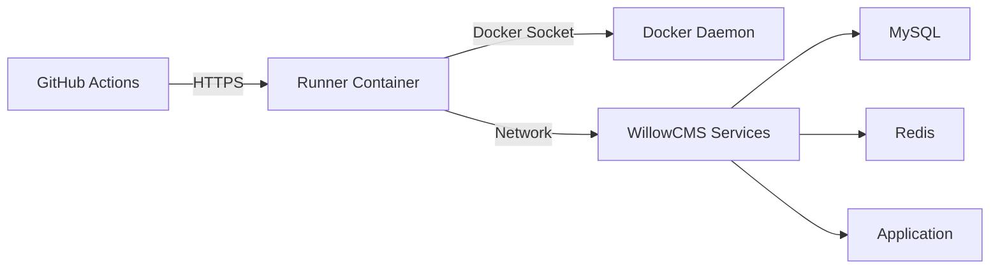

# GitHub Actions Self-Hosted Runner for WillowCMS

A Dockerized self-hosted GitHub Actions runner configured for WillowCMS builds and deployments, supporting both ARM64 and AMD64 architectures.

## 📋 Table of Contents

- [Overview](#overview)
- [Features](#features)
- [Prerequisites](#prerequisites)
- [Quick Start](#quick-start)
- [Configuration](#configuration)
- [Usage](#usage)
- [Workflows](#workflows)
- [Security](#security)
- [Troubleshooting](#troubleshooting)
- [Maintenance](#maintenance)
- [Architecture](#architecture)

## Overview

This self-hosted runner setup provides a hybrid approach to GitHub Actions:
- **Build jobs** run on self-hosted runners for faster execution and cost savings
- **Deployment to GitHub Pages** uses GitHub-hosted runners (required by GitHub)
- **Fallback support** automatically uses GitHub-hosted runners if self-hosted unavailable

## Features

✅ **Multi-platform Support**: ARM64 and AMD64 architectures
✅ **Pre-configured Environment**: PHP 8.1, Node.js 18, Composer, Docker
✅ **Integrated Networking**: Connects to existing WillowCMS services
✅ **Security Hardened**: Non-root user, ephemeral mode support
✅ **Resource Management**: CPU and memory limits
✅ **Health Monitoring**: Built-in health checks and status reporting
✅ **Cache Persistence**: Composer and npm cache volumes

## Prerequisites

- Docker and Docker Compose installed
- GitHub Personal Access Token (PAT) with appropriate permissions
- Access to your GitHub repository settings
- At least 4GB RAM and 2 CPU cores available

## Quick Start

### 1. Clone and Navigate

```bash
cd /Volumes/1TB_DAVINCI/docker/willow/tools/github-runner
```

### 2. Configure Environment

```bash
# Copy the template
cp .env.runner.example .env.runner

# Edit with your values
nano .env.runner
```

Required configuration:
- `GITHUB_TOKEN`: Your Personal Access Token
- `GITHUB_OWNER`: Your GitHub username or organization
- `GITHUB_REPOSITORY`: Repository name (e.g., `willow`)

### 3. Start the Runner

```bash
# Make scripts executable
chmod +x scripts/*.sh

# Start the runner
./scripts/start.sh
```

### 4. Verify Setup

```bash
# Check status
./scripts/status.sh

# View logs
docker logs -f github-runner
```

### 5. Test the Runner

Go to your GitHub repository and run the test workflow:
1. Navigate to Actions tab
2. Select "Test Self-Hosted Runner"
3. Click "Run workflow"
4. Check the results

## Configuration

### Environment Variables

Edit `.env.runner` to configure:

```bash
# GitHub Configuration
GITHUB_TOKEN=ghp_xxxxxxxxxxxx        # Your PAT token
GITHUB_OWNER=your-username           # Repository owner
GITHUB_REPOSITORY=willow            # Repository name

# Runner Configuration
RUNNER_NAME=willowcms-runner-1      # Unique runner name
RUNNER_LABELS=self-hosted,linux,x64,willowcms
RUNNER_EPHEMERAL=false              # Set to true for one-job runners

# Platform
PLATFORM=linux/amd64                 # or linux/arm64 for ARM

# Resources
RUNNER_CPU_LIMIT=2.0                # CPU cores limit
RUNNER_MEMORY_LIMIT=4G              # Memory limit
```

### Docker Compose Options

For production deployment with Docker Compose:

```bash
# Start with Docker Compose
docker compose -f docker-compose-runner.yml up -d

# Stop runner
docker compose -f docker-compose-runner.yml down

# View logs
docker compose -f docker-compose-runner.yml logs -f
```

## Usage

### Management Scripts

All management scripts are in the `scripts/` directory:

| Script | Purpose |
|--------|---------|
| `start.sh` | Start the runner container |
| `stop.sh` | Stop the runner container |
| `status.sh` | Check runner health and status |
| `entrypoint.sh` | Container entrypoint (internal use) |

### Workflow Configuration

#### Using Self-Hosted Runner

In your workflow files, specify the runner:

```yaml
jobs:
  build:
    runs-on: [self-hosted, linux, willowcms]
    steps:
      - uses: actions/checkout@v5
      - name: Build
        run: ./build.sh
```

#### Hybrid Approach (Recommended)

Use the hybrid workflow template for automatic fallback:

```yaml
jobs:
  build:
    runs-on: ${{ matrix.runner }}
    strategy:
      matrix:
        runner:
          - [self-hosted, linux, willowcms]
      fail-fast: false
    steps:
      - uses: actions/checkout@v5
```

## Workflows

### Available Workflows

1. **deploy-pages-hybrid.yml**: Main deployment workflow with hybrid runner strategy
2. **test-self-hosted.yml**: Runner validation and testing

### Running Workflows

```bash
# Via GitHub CLI
gh workflow run deploy-pages-hybrid.yml

# Via GitHub UI
# Navigate to Actions → Select workflow → Run workflow
```

## Security

### Best Practices

1. **Token Management**
   - Use fine-grained Personal Access Tokens
   - Rotate tokens every 90 days
   - Never commit tokens to version control

2. **Runner Configuration**
   - Enable ephemeral mode for production
   - Use specific runner labels
   - Implement resource limits

3. **Network Security**
   - Runners operate in isolated Docker network
   - No exposed ports by default
   - Communication via Docker socket only

### Required GitHub Token Scopes

Create a PAT with these permissions:
- `repo` - Full repository access
- `workflow` - Update GitHub Actions workflows
- `admin:org` - For organization runners (optional)

Generate token at: https://github.com/settings/tokens/new

## Troubleshooting

### Common Issues

#### Runner Not Starting

```bash
# Check Docker service
docker info

# Check network
docker network ls | grep willow_default

# Check logs
docker logs github-runner
```

#### Authentication Failed

```bash
# Verify token
echo $GITHUB_TOKEN

# Test GitHub API
curl -H "Authorization: token $GITHUB_TOKEN" \
     https://api.github.com/user
```

#### Resource Issues

```bash
# Check available resources
docker system df
free -h
df -h

# Clean up
docker system prune -a
```

### Debug Mode

Enable detailed logging:

```bash
# Edit .env.runner
RUNNER_DEBUG=true
ACTIONS_STEP_DEBUG=true

# Restart runner
./scripts/stop.sh
./scripts/start.sh
```

## Maintenance

### Regular Tasks

#### Weekly
- Review runner logs
- Check disk usage
- Update dependencies

#### Monthly
- Rotate GitHub tokens
- Update runner version
- Clean build caches

#### Quarterly
- Security audit
- Performance review
- Update documentation

### Updating Runner Version

```bash
# Edit Dockerfile
ARG RUNNER_VERSION=2.320.0  # Update version

# Rebuild image
docker build -t willowcms-github-runner:latest .

# Restart runner
./scripts/stop.sh
./scripts/start.sh
```

### Backup and Recovery

```bash
# Backup runner configuration
tar -czf runner-backup-$(date +%Y%m%d).tar.gz \
    .env.runner \
    config/

# Restore from backup
tar -xzf runner-backup-20240115.tar.gz
```

## Architecture

### Container Structure

```
github-runner/
├── Dockerfile              # Multi-platform runner image
├── docker-compose-runner.yml  # Compose configuration
├── .env.runner.example     # Environment template
├── scripts/
│   ├── entrypoint.sh      # Container entrypoint
│   ├── start.sh           # Start runner
│   ├── stop.sh            # Stop runner
│   └── status.sh          # Check status
├── config/                # Runner configuration
├── workspace/             # Job workspace
└── logs/                  # Runner logs
```

### Network Architecture



### Resource Allocation

| Component | CPU | Memory | Storage |
|-----------|-----|--------|---------|
| Minimum | 0.5 cores | 512MB | 10GB |
| Recommended | 2 cores | 4GB | 50GB |
| Production | 4+ cores | 8GB+ | 100GB+ |

## Performance Optimization

### Cache Configuration

Persistent caches improve build times:

```yaml
volumes:
  runner_composer_cache:/home/runner/.composer
  runner_npm_cache:/home/runner/.npm
  runner_cache:/home/runner/.cache
```

### Parallel Execution

Run multiple runners for parallel jobs:

```bash
# Start multiple runners with unique names
RUNNER_NAME=runner-1 ./scripts/start.sh
RUNNER_NAME=runner-2 ./scripts/start.sh
```

## Cost Analysis

### Comparison: Self-Hosted vs GitHub-Hosted

| Metric | GitHub-Hosted | Self-Hosted |
|--------|---------------|-------------|
| Setup Cost | $0 | ~2 hours |
| Monthly Cost | $0.008/minute | Infrastructure only |
| Performance | Variable | Consistent |
| Availability | 99.9% | Your uptime |
| Maintenance | None | Required |

### Break-Even Analysis

- **Small projects** (<2,000 minutes/month): Use GitHub-hosted
- **Medium projects** (2,000-10,000 minutes): Hybrid approach
- **Large projects** (>10,000 minutes): Self-hosted recommended

## Support

### Resources

- [GitHub Actions Runner Documentation](https://docs.github.com/en/actions/hosting-your-own-runners)
- [WillowCMS Documentation](../../docs/README.md)
- [Docker Documentation](https://docs.docker.com)

### Getting Help

1. Check the [Troubleshooting](#troubleshooting) section
2. Review runner logs: `docker logs github-runner`
3. Check GitHub Actions tab for workflow errors
4. Open an issue in the repository

## License

This project is part of WillowCMS and follows the same license terms.

---

**Last Updated**: October 2024
**Version**: 1.0.0
**Maintainer**: WillowCMS Team